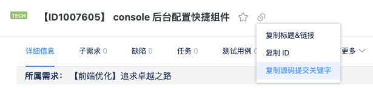

[](https://github.com/threfo/change_log_action/actions/workflows/check-dist.yml)

# change_log_action

提交 pr 的时候获取所有的 commits 信息进行分析整理成 changelog，[具体效果](https://github.com/threfo/change_log_action/pull/1)

## demo

示例请看 [.github/workflows/demo.yml](.github/workflows/demo.yml)

[详细要求](action.yml)

## changelog 提取规则

详细请看单测 [src/utils/\_\_tests\_\_/format.test.ts](src/utils/__tests__/format.test.ts)

```bash
:gitmoji:? type(scope?): subject
# 需要空行
body?
# 需要空行
footer?
```

- `gitmoji`：作为视觉化辨认 commit 要素的
- `type`： 作为日志与版本环节中重要的标记结构，输出结构化的日志与语义化版本，会根据这个来分类，没有填会警告
- `scope`：限定 commit 的修改范围，会根据这个来分类，没有填时为 other
- `subject`：记录工作的内容，相当于一句话描述
- `body`：记录工作的详细内容，可选
- `footer`： 说明是否存在 Break Change 等，如 api 变更、权限变革、重要配置，可选

## 常用场景举例

### tapd 相关信息提交

根据现团队习惯已支持 tapd 的信息提取



在上图复制内容黏贴提交

```bash
git commit -m "--story=100000 --user=Thomas 【管理后台配置】后台配置快捷组件 https://www.tapd.cn/23766501/s/1240224"

# 或者

git commit -m "feat: --story=100000 --user=Thomas 【管理后台配置】后台配置快捷组件 https://www.tapd.cn/23766501/s/1240224"

# 或者

git commit -m "story(管理后台配置): 后台配置快捷组件 #100000"
```

则生成

```md
## 管理后台配置

### story

<details>
<summary>后台配置快捷组件</summary>
2022/01/05 06:14 | <a href="https://github.com/threfo/change_log_action/commit/111" title="thomas-ballo | liurongliang@balloai.com" target="_blank">详细代码</a> | <a href="https://www.tapd.cn/23766501/s/1240224" target="_blank">issue 100000</a>
</details>
```

### api 或配置 变更/新增时建议

```bash
git commit -m "feat: --story=100000 --user=Thomas 【管理后台配置】后台配置快捷组件 https://www.tapd.cn/23766501/s/1240224
dquote>
dquote> api的调用参数或者ypai链接，实例变更脚本链接，配置链接或者示例等
dquote>
dquote> 新增 get /test/api?t=把变更的api或者新增的api填在这里
dquote> 修改 post /test/api
dquote> 新增 resume_version 版本控制配置"
```

则生成

```md
## 管理后台配置

### story

<details>
<summary>后台配置快捷组件</summary>
2022/01/05 06:14 | <a href="https://github.com/threfo/change_log_action/commit/111" title="thomas-ballo | liurongliang@balloai.com" target="_blank">详细代码</a> | <a href="https://www.tapd.cn/23766501/s/1240224" target="_blank">issue 100000</a>
api的调用参数或者ypai链接，实例变更脚本链接等

新增 get /test/api?t=把变更的 api 或者新增的 api 填在这里
修改 post /test/api

</details>

## ⚠️ 需要注意

<details>
<summary>新增 get /test/api?t=把变更的api或者新增的api填在这里
修改 post /test/api
新增 resume_version 版本控制配置</summary>
api的调用参数或者ypai链接，实例变更脚本链接，配置链接或者示例等

2022/01/05 06:14 | <a href="https://github.com/threfo/change_log_action/commit/111" title="thomas-ballo | liurongliang@balloai.com" target="_blank">详细代码</a> | <a href="https://www.tapd.cn/23766501/s/1240224" target="_blank">issue 100000</a>

</details>
```

### 如果我之前已经提交了一次某个需求的内容，现在只是改个拼写错误该怎么提交？

目前脚本是支持相同的 `type(scope?): subject` 会自动合并，所以你只需要

```bash
# 第一次提交
git commit -m "feat: --story=100000 --user=Thomas 【管理后台配置】后台配置快捷组件 https://www.tapd.cn/23766501/s/1240224"

# 第二次提交
git commit -m "feat: --story=100000 --user=Thomas 【管理后台配置】后台配置快捷组件 https://www.tapd.cn/23766501/s/1240224
dquote>
dquote> 修改拼写错误"

# 或者
git commit -m "feat(管理后台配置): 后台配置快捷组件
dquote>
dquote> 修改拼写错误"
```

在 changelog 生成时都会合并成

```md
## 管理后台配置

### story

<details>
<summary>后台配置快捷组件</summary>
2022/01/05 06:14 | <a href="https://github.com/threfo/change_log_action/commit/111" title="thomas-ballo | liurongliang@balloai.com" target="_blank">详细代码</a> | <a href="https://www.tapd.cn/23766501/s/1240224" target="_blank">issue 100000</a>

2022/01/06 00:14 | <a href="https://github.com/threfo/change_log_action/commit/111" title="thomas-ballo | liurongliang@balloai.com" target="_blank">详细代码</a> | <a href="https://www.tapd.cn/23766501/s/1240224" target="_blank">issue 100000</a>
修改拼写错误

</details>
```

当然以上的生成可以通过编辑或者复制出来修改

## 参与开发

```bash
# 安装依赖
npm i

# 跑测试
npm test

# 构建
npm all
```

## 相关资料

[GitHub Actions 入门教程(阮一峰)](https://www.ruanyifeng.com/blog/2019/09/getting-started-with-github-actions.html)

[GitHub Actions 可以监听的列表](https://docs.github.com/en/actions/learn-github-actions/events-that-trigger-workflows)

[项目内集成规范的提交信息](https://github.com/thomas-bello/changelog)
